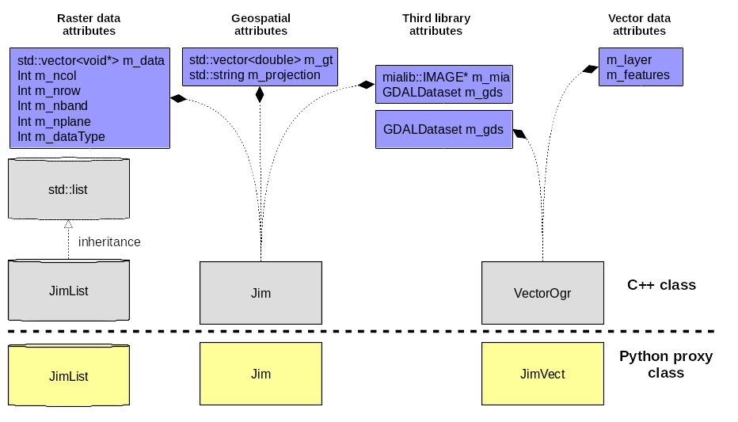
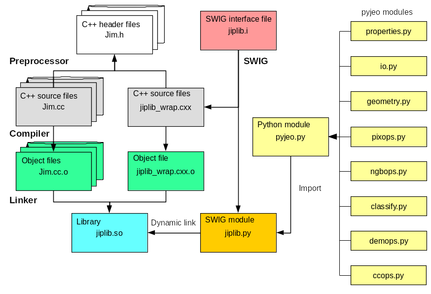

.. _Introduction:

============
Introduction
============

Organization of pyjeo
---------------------

Modules
^^^^^^^

The pyjeo package is grouped in modules. A module combines a number of operations that belong together. The models defined pyjeo are:

 * properties: get properties of a class object
 * io: input/output operations
 * geometry: operations that relate to geometry
 * pixops: pixel operations
 * ngbops: neighborhood operations
 * clssfy: classification operations
 * ccops: segmentation operations
 * demops: operations on digital elevation models

.. _functions_methods:

Functions and methods
^^^^^^^^^^^^^^^^^^^^^

Operations on pyjeo objects are distinguished in functions and methods. Methods directly operate on objects, i.e., instances of a class. A method implicitly has access to the object attributes on which it was called. For instance, methodX that operates on myobject that belongs to moduleA and takes a single argument (arg1) is typically called like this::

  myobject.moduleA.methodX(arg1)
     
Functions that operate on objects must have the objects passed as arguments. An example of a function (functionY) that belongs to the same module (moduleA) and operates on myobject using an extra boolean argument (flag1) is::

  newobject = pyjeo.moduleA.functionY(myobject, flag1=True)

In this case a new object (newobject) is returned. The functions that return a new object are non-destructive, i.e., they do not alter the object that was passed as an argument. This follows the principle of command-query-separation. 

Methods can be either destructive or non-destructive. Destructive methods do not return any object. For instance, in the following example::

  object.moduleB.destructiveMethod()
  
the object is altered and no object is returned. Methods that are non-destructive can return a new object, for instance, the method getMethodZ in module properties returns the attributeZ from myobject::

   myattributeZ = myobject.properties.getAttributeZ()

Modifying objects in-place can minimize the memory footprint, but the original object is lost. According to the principle of command-query-separation :cite:`meyer1988`, functions that change state should not return values and functions that return values should not change state. Following this principle, pyjeo functions that modify the object in-place return **None**. To avoid confusion with functions that return a new object, they have been implemented as methods that are bound to a class. For instance to subset the first band of a *Jim* instance in-place, use::

  jim.geometry.cropBand(0)

After the call, the object *jim* will be a single-band raster dataset. No new object is returned and the original object is lost. A corresponding function is implemented that is not bound to a class::

  jim0=pyjeo.geometry.cropBand(jim,0)

returns the new single-band object *jim0*. In this case, all objects are passed explicitly as arguments and are not modified. 

Design of pyjeo
---------------

Design in C++
^^^^^^^^^^^^^

The pyjeo package largely depends of the JIPlib library, which is implemented in C++ and contains three main classes: Jim, JimList and VectorOgr (see :numref:`Fig:jiplib_classes`). Each of these classes is represented by a Python proxy class in pyjeo: Jim, JimList and JimVec. In addition to the methods from the C++ class JimList, the Python class JimList inherits all methods from a Python list (e.g., :code:`len`, :code:`append`, :code:`extend`, :code:`insert`, :code:`remove`, :code:`count`)

.. _Fig:jiplib_classes:

    Overview of the classes in the JIPlib library

Building a Python interface via SWIG
^^^^^^^^^^^^^^^^^^^^^^^^^^^^^^^^^^^^

The Simplified Wrapper and Interface Generator (SWIG) produces a wrapper file that is compiled and linked into a dynamic library (see :numref:`Fig:jiplib_swig`). 

.. _Fig:jiplib_swig:

    Using SWIG to build a Python interface from C++

   
Installation
------------

From the directory of the repository, run::

  sudo python setup.py install

Testing
-------

To test the installation, run::

  python -W ignore -m unittest -v tests

To test a specific module (e.g.,classify), run::

  python -W ignore -m unittest -v tests/test_classify.py

Documentation
-------------

Dependencies:

- python3-sphinx
- python3-sphinxcontrib.bibtex
- latexmk (for pdf output)
- sphinx_rtd_theme (via pip install)

To build the documentation::

  cd doc
  make html
  make latexpdf

Usage
-----

Usage in your local environment
^^^^^^^^^^^^^^^^^^^^^^^^^^^^^^^
In your local environment, import the pyjeo module::

  import pyjeo as pj

Usage in the JEOdesk
^^^^^^^^^^^^^^^^^^^^
The pyjeo module is can be imported as::

  import pyjeo as pj

An environment variable must be set (replace version of pyjeo with latest version)::

  PYTHONPATH=/eos/jeodpp/shared/prod/lib/python/jeodesk-16:/eos/jeodpp/shared/prod/lib/python/jeodesk-16/pyjeo-0.6.0-py3.5.egg

Usage in the execute function in the interactive processing JEOlab
^^^^^^^^^^^^^^^^^^^^^^^^^^^^^^^^^^^^^^^^^^^^^^^^^^^^^^^^^^^^^^^^^^^
The pyjeo module is automatically imported as pj

Usage on the cluster
^^^^^^^^^^^^^^^^^^^^
In your condor submit file, use this docker file (replace 0.5.26 with latest version)::
  
  Docker_image = jeoreg.cidsn.jrc.it:5000/jeodpp-htcondor/base_gdal_py3_deb10_pyjeo:0.5.26
