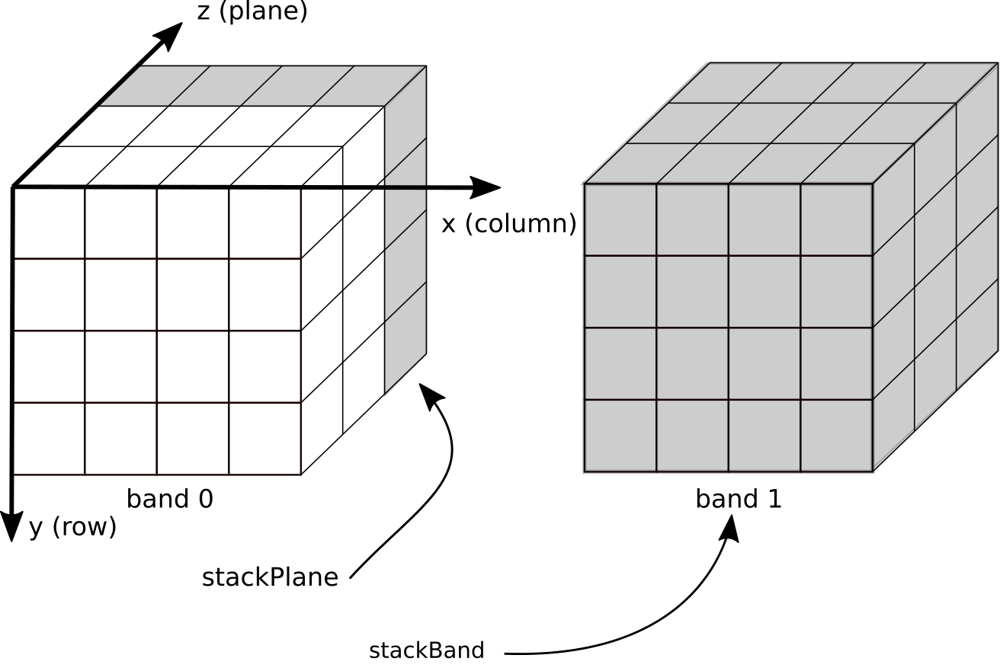
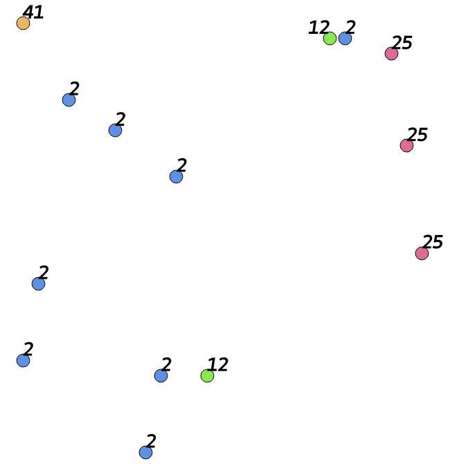
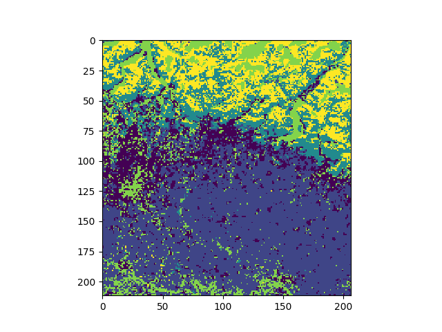
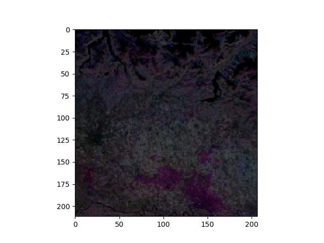
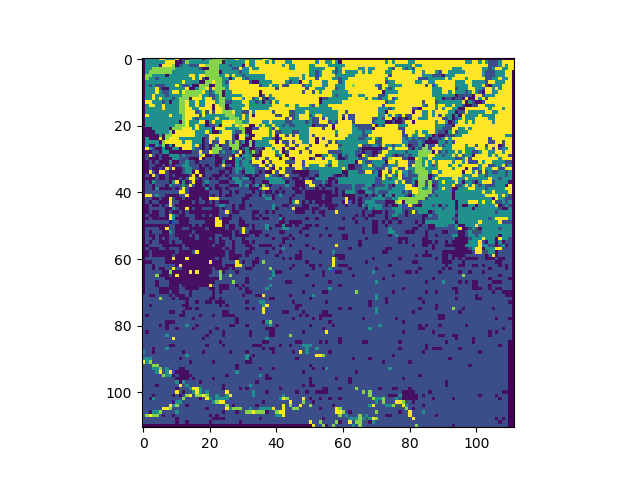
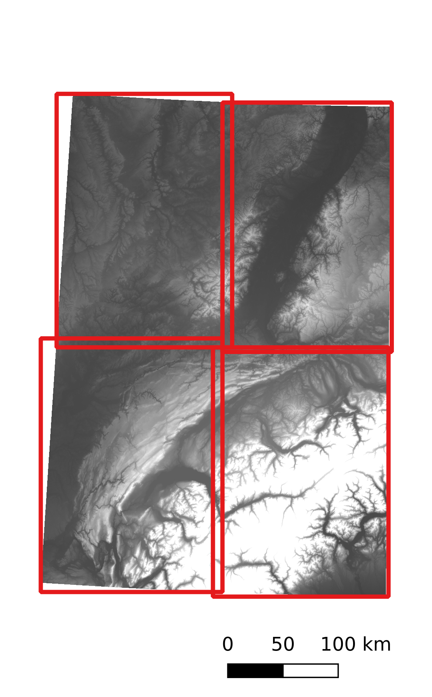
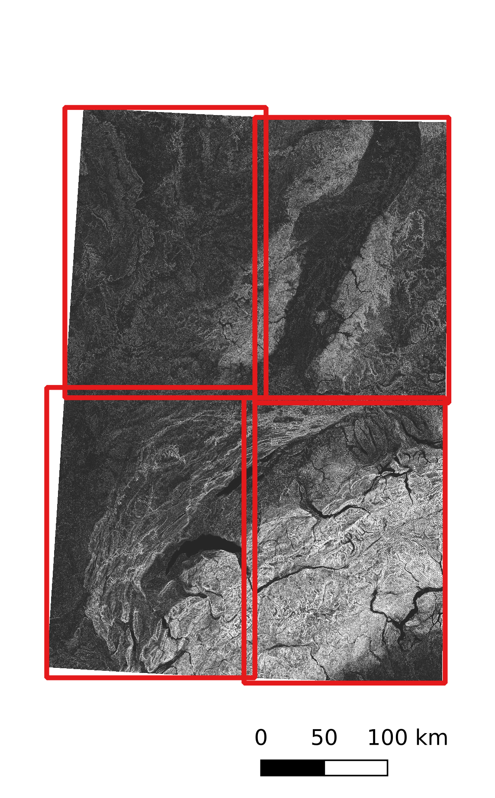

.. _Tutorial:

########
Tutorial
########

.. toctree::
   :maxdepth: 4

*******************************************************
Sources of documentation and help
*******************************************************

This documentation is written using the `sphinx <http://www.sphinx-doc.org>`_ tool.

====================
Online documentation
====================

This documentation is available in the source code under the doc directory (details on how to compile can be found in the README.md file). There is online version in html format available on this `website <https://pyjeo.readthedocs.io>`_.

The documentation is divided in three main parts:

* :ref:`Introduction`: Introduction explaining the organization of the pyjeo package, its modules, design, installation and usage.

* :ref:`Tutorial`: A tutorial to guide you through the first steps of using pyjeo, introducing the main data structures :py:class:`Jim`, :py:class:`JimList`, and :py:class:`JimVect`.

* :ref:`Reference_manual`: A manual describing all functions and methods available in pyjeo

====================
Inline documentation
====================

In addition to the online help pages, there is the inline documetation. 

To get help on a specific module, e.g., :py:mod:`geometry`::

  help(pj.geometry)

To get help on a class, e.g., :py:class:`Jim`::

  help(pj.Jim)

To get help on a function, e.g., :py:func:`geometry.warp`::

  help(pj.geometry.warp)

To get help on a class method, e.g., :py:meth:`~geometry._Geometry.warp`::

  jim = pj.Jim()
  help(jim.geometry.warp)

.. _Tutorial_jim:

*************************************
Tutorial on Jim objects (raster data)
*************************************

Jim is the main class to represent raster data objects. You can create a new Jim in different ways:

- opening :ref:`from file <create_Jim_from_file>` in some format supported by GDAL;
- :ref:`create new <create_Jim_new>` Jim objects by specifying all the attributes (e.g., data type, columns, rows, etc.);
- using the :ref:`copy constructor <Jim_copy_constructor>`;
- from a :ref:`Numpy array object <Jim_numpy_constructor>`;
- as the result of one of the :ref:`functions <functions_methods>`.

.. _data_model:

==========
Data model
==========

It is important to understand the data model that is used for a Jim object. For a more detailed description, please refer to :cite:`kempeneers2019`.

The data model used is a multi-band three dimensional (3D) model. Each band represents a 3D contiguous array in memory, where data are organized as *[plane][row][column]* (see also :py:meth:`Jim.np`). Two dimensions refer to the spatial domain (x and y) and pyjeo refers to the third dimension as *plane* (see :numref:`cube`). This plane is typically used for either the temporal or spectral dimension, but can also be used to address volumetic data.  The data cube has a single georeference.

.. _cube:

   Data model used for Jim objects.

When creating an geospatial image from file (e.g., in GeoTIFF format), the attributes for the geotransform and projection is set automatically and stored in the Jim object. These attributes can be retrieved with the methods in the :py:mod:`properties` module::

  import pyjeo as pj

  jim = pj.Jim('/path/to/raster.tif')
  print(jim.properties.getBBox())
  
output::

  [399960.0, 5100000.0, 405080.0, 5094880.0]

where the list returned represents the upper left x, upper left y, lower right x, and lower right y coordinates respectively. 

As a default, a multi-band raster dataset is read as a single plane multi-band Jim object. To consider the input bands as planes and create  a (single-band) 3D multi-plane Jim object, an extra argument *band2plane* can be set (see :ref:`Jim constructor <create_Jim_from_file>`).   Planes and bands can be stacked :py:meth:`~geometry._Geometry.stackPlane`, :py:meth:`~geometry._Geometry.stackBand` and subset (:py:meth:`~geometry._Geometry.cropPlane`, :py:meth:`~geometry._Geometry.cropBand`) as shown in :numref:`cube`. Dimensions must correspond across all bands within the same *Jim* object. To collect objects with different dimensions, a *JimList* can be used (which inherits from a plain Python list). Multi-dimensional data with dimensions above three are not supported in pyjeo. Bands can be converted to planes and vice versa at the cost of a (temporary) memory copy (see :py:meth:`~geometry._Geometry.band2plane` and :py:meth:`~geometry._Geometry.plane2band`). 

An advantage of this data model with both planes and bands is that the user can control how data is stored in memory. Multi-plane images are ideal for 3D operations and allow to bridge pyjeo to third party libraries such as Numpy, scipy, and xarray that expect 3D Numpy arrays (see :ref:`bridge_jim_third_party`). Multi-band Jim objects, on the other hand, have their bands stored in separate memory pointers and can easily be processed in parallel with multi-threading using the Open MPI bindings. In addition, warping multi-band images take advantage of the single georeference object they have in common. This requires only a single function call to *GDALReprojectImage* (`gdalwarper.h <https://gdal.org/doxygen/gdalwarper_8h.html>`_).

The simple data model with contiguous arrays allows to combine pyjeo with other software such as GDAL, GSL, and Python packages that are compatible with Numpy arrays (e.g., `xarray <http://xarray.pydata.org>`_ , `SciPy <https://www.scipy.org/>`_). A direct bridge to Numpy arrays and xarray (if installed) is included in pyjeo, without the generation of an extra copy in memory.

In particular, when dealing with geospatial data that have a large memory footprint, careful memory handling is important. To this end, users can choose if pyjeo functions modify objects in-place or return a new object (see also :ref:`functions_methods`).  

.. _bridge_jim_third_party:

====================================
Bridging Jim to third party packages
====================================

Jim objects can be easily converted to `Numpy <https://numpy.org>`_ arrays and `xarray <http://xarray.pydata.org>`_ objects either with or without duplicating the memory (see also :ref:`Jim_conversions`). A Numpy array object derived from a Jim object without a memory copy references to the same data in memory as the original Jim object. This reduces the memory footprint, but can lead to memory errors. The Jim object should remain the owner of the data and the referenced Numpy array object should not be altered in shape nor destroyed.

However, if handled with care, this can be a powerful technique.
As shown in :ref:`ndimage` and :ref:`dem_richdem`, third party libraries operating on Numpy arrays can directly written into Jim objects. For instance, to Gaussian filter a Jim object using `SciPy <https://www.scipy.org/>`_, simply use::

  from scipy import ndimage
  jim.np()[:] = ndimage.gaussian_filter(jim.np(), 2)

.. _Tutorial_jim_read:

=============================
Reading Jim objects from file
=============================

In pyjeo, images are read from file into memory. Depending on the file size and the memory resources available, this is not always possible.
However, for many (e.g., pixel wise) operations, images can be tiled first. Each tile can then processed individually, which reduces the memory footprint. Tiling also allows for embarrassingly parallel processing, where little or no effort is needed to separate the problem into a number of parallel tasks. This is particularly useful in a cluster computing environment, but also for multi-core computers with sufficient memory (all tiles must be able to be read in memory). Two methods are shown here how to read only a spatial subset of an image.

.. _reading_roi:

==================
Region of interest
==================

In the following example, a large geographical extent is covered by a virtual raster file (VRT) that represents many GeoTIFF files in different directories. We want to read only a small spatial subset of the raster. The spatial subset is defined by a polygon in a different projection (epsg:4326) than the raster VRT::

  worldvrt = Path('/path/to/world.vrt')
  wkt_string = 'POLYGON ((23.314208 37.768469, 24.039306 37.768469, ' \
                '24.039306 38.214372, 23.314208 38.214372, ' \
                '23.314208 37.768469))'

  vect = pj.JimVect(wkt=wkt_string)
  jim = pj.Jim(worldvrt, bbox = vect.properties.getBBox(), t_srs = vect.properties.getProjection())

.. note::

      Although the bounding box (`bbox`) is defined in a different target spatial reference (`t_srs`), the Jim object is not re-projected (see also :ref:`create_Jim_from_file`).

.. _image_tiling:

============
Image tiling
============

Jim objects support a tiling approach when reading from file with with the specific keys *tileindex*, *tiletotal*, and *overlap* (see also :ref:`create_Jim_from_file`).

As an example, we read only a portion of the image from file, dividing in *tiletotal* tiles (tiletotal must be a squared integer, e.g., 2^2 = 4, 3^2 = 9, ..., 32^2 = 1024,...). The parameter *tileindex* indicates the tile to be read (from 0 to *tiletotal*-1). An overlap > 0 is of particular interest when tiles must be re-projected or in case of a neighborhood operation::

  tiletotal = 16
  for tileindex in range(0,16):
    jim = pj.Jim('/path/to/raster.tif', tileindex = 0, tiletotal = tiletotal, overlap = 5)
    # do stuff with jim ...
    #write tiled result
    jim.io.write('result_'+str(tileindex)+'.tif')

To merge all tiled results as single virtual file, the Python bindings of GDAL can be used::

  from osgeo import gdal

  vrtfn = 'result.vrt'
  vrtfile = gdal.BuildVRT(str(vrtfn),['result_'+str(tileindex)+'.tif' for
                                      tileindex in range(0, tiletotal],
                          options=gdal.BuildVRTOptions(srcNodata=0))
  vrtfile = None

.. _Tutorial_jim_write:

===========================
Writing Jim objects to file
===========================

Jim objects can be written to file in different file formats (see also :py:meth:`~pjio._IO.write`). Currently, only those formats for which a GDAL driver exists that implements a `Create method <https://gdal.org/tutorials/raster_api_tut.html#using-create>`_ are supported. This excludes many sequential write once formats (such as JPEG and PNG). An overview of the drivers that support *Create* is given on the `GDAL <https://gdal.org/drivers/raster/index.html>`_ website. The default format used is `GTiff <https://gdal.org/drivers/raster/gtiff.html>`_.

Depending on the file format, a number of creation options (with the key argument *co* and a list of string values) can be set. For example the GTiff format supports compression and tiling. To write a tiled GTiff file with LZW compression::

  jim.io.write('/tmp/test.tif', 'co': ['COMPRESS=LZW', 'TILED=YES']})

.. _Tutorial_netcdf_write:

Few file formats support writing a multi-band 3D raster data. One of those is `NetCDF <https://gdal.org/drivers/raster/netcdf.html#raster-netcdf>`_. Suppose we have created a 3D Jim object, we can write it to a NetCDF file::

  jim.io.write(ncfile, oformat = 'netCDF')

.. _Tutorial_jimvect:

*****************************************
Tutorial on JimVect objects (vector data)
*****************************************

JimVect is the main class to represent vector data objects. You can create a new JimVect:

- via the :py:meth:`JimVect` constructor passing a file path that represents a vector in some GDAL supported format;
- via the :py:meth:`JimVect` constructor passing a vector in well known text (WKT) or JSON format;
- via the :ref:`copy constructor <JimVect_copy_constructor>`
- as the result of one of the :ref:`functions <functions_methods>`.

Examples for creating a JimVect object from file are given in the reference (see :py:meth:`JimVect`). Here, we show how to create a JimVect by passing a vector in JSON and WKT format::

  jsonstring = \
      '{"polygons": ' \
          '{"type": "FeatureCollection", ' \
          '"crs": ' \
              '{"type": "name", ' \
              '"properties": ' \
              '{"name": "urn:ogc:def:crs:OGC:1.3:CRS84"}}, ' \
          '"features": ' \
              '[{"type": "Feature", ' \
              '"properties": {"label": 1}, ' \
              '"geometry": ' \
                  '{"type": "Polygon", ' \
                  '"coordinates": ' \
                      '[[[ 16.296883885037882, 48.07125730037879 ], ' \
                      '[ 16.29418254261364, 47.787616345833342 ], ' \
                      '[ 16.518393963825762, 47.814629770075761 ], ' \
                      '[ 16.413041609280306, 48.04424387613637 ], ' \
                      '[ 16.296883885037882, 48.07125730037879 ]]' \
      ']}}]}}'

  jsonvect = pj.JimVect(jsonstring)

Open a vector by passing a vector in WKT format::

  wkt_string = 'POLYGON ((23.314208 37.768469, 24.039306 37.768469, ' \
                '24.039306 38.214372, 23.314208 38.214372, ' \
                '23.314208 37.768469))'

  vect = pj.JimVect(wkt=wkt_string)

When copying a JimVect object using the :ref:`copy constructor <JimVect_copy_constructor>` a new JimVect object is created for which an output filename must be defined. The default output format is `SQLite <https://gdal.org/drivers/vector/sqlite.html>`_::

  v_copy = pj.JimVect(v_original, output = '/tmp/test.sqlite')

.. note::

      Specifying a filename with the prefix */vsimem/* creates a JimVect in memory

Creating a copy of a JimVect in memory::

  v_copy = pj.JimVect(v_original, output = '/vsimem/v_copy.sqlite')

Alternatively, a JimVect can be created in memory using the `Memory <https://gdal.org/drivers/vector/memory.html>`_ driver::

  v_copy = pj.JimVect(v_original, output = 'v_copy', oformat = 'Memory')

.. _bridge_jimvect_third_party:

========================================
Bridging JimVect to third party packages
========================================

JimVect objects can be easily exported to a Python dictionary (:py:meth:`JimVect.dict`) and `Numpy <https://numpy.org>`_ array (:py:meth:`JimVect.np`). A dictionary and Numpy array will only contain the fields of a JimVect (no geometry information). A dictionary can take alphanumeric values. When creating a Numpy array from a JimVect, all fields will be converted to numerical values.

Create a JimVect object from a cloud vector in GML format and print the field names::

  fn = 'MSK_CLOUDS_B00.gml'
  v = pj.JimVect(fn)
  print(v.properties.getFieldNames())

  ['gml_id', 'maskType']

Export the vector to a dictionary and print the first values of the keys 'gml-id' and 'maskType'::

  print(v.dict()['gml_id'][0])
  print(v.dict()['maskType'][0])

output::

  OPAQUE.0
  OPAQUE

The obtained dictionary or Numpy array are always copies (not a reference to the data in memory). Therefore, unlike the case of a Jim object, the feature values of a JimVect cannot be overwritten.

A bridge to third party packages using `pandas <https://pandas.pydata.org/pandas-docs/stable/index.html>`_, and `geopandas <https://geopandas.org/>`_ is supported. However, the JimVect must first be written to file (which can be in memory using the prefix */vsimem/*). Only geopandas object retain the geometry of the JimVect object::

  import geopandas as gpd
  v = pj.JimVect('vector.shp)
  #convert to GeoJSON in memory
  vjson = pj.JimVect(v,output='/vsimem/pj.json', oformat = 'GeoJSON')
  vjson.io.write()
  #create geopandas dataframe from GeoJSON file in memory
  gdf = gpd.read_file('/vsimem/pj.json')

.. note:
   The JimVect vjson must be closed before opening the vector geopandas in order to flush the file stream

.. _Tutorial_compositing:

***********************
Tutorial on compositing
***********************

Compositing is the process of resolving overlapping pixels when images are combined. The method :py:meth:`~geometry._Geometry.reducePlane` in the :py:mod:`geometry` module deals with the compositing of multi-plane images. The overlapping images are therefore be in the same geometry (same projection, number of columns, rows, and bands). A multi-plane Jim object can be obtained from individual images with the method :py:meth:`~geometry._Geometry.stackPlane`::

  jim = pj.Jim('/path/to/raster0.tif')
  jim.geometry.stackPlane(pj.Jim('/path/to/raster1.tif'))

The maximum composite image can then obtained as follows. By setting the parameter *nodata* to 0, pixel values equal to 0 are not considered for the calculation of the maximum value::

  jim.geometry.reducePlane('max', nodata = 0)

In the case of a multi-band Jim object, the composite result will also be a multi-band image. The maximum value is calculated for each band individually. Pixel values of the resulting composite in the respective bands are not guaranteed to be selected from the same input plane. If this is required, the parameter *ref_band* can be used. This will be the reference band for which the rule will be calculated. A typical example is the maximum normalized difference vegetation index (NDVI) composite. Suppose a multi-plane and multi-band Jim object contains four bands in total, from which the last band represents the NDVI value. Setting ref_band to 3 (corresponding to the NDVI band) and the rule equal to 'max' will calculate the maximum NDVI composite. All band values of a pixel in the resulting composite will be selected from the plane for which the NDVI was maximum. 

Other pre-defined compositing rules then 'median' are: 'mean', 'min', and 'max'. However, via a call-back function, you can create your own composite rule. Call-back functions cannot be combined with the parameters *ref_band* and *nodata*. As an example, we show how to create a mximum NDVI value composite, where the NDVI is calculated within the call-back function. The input image (jim) is a multi-band and multi-plane (temporal) image. The bands corresponding to the red and near infrared spectral bands respectively. In case the data type is already float or double, the lines to convert the data type to 'GDT_Float32' can be omitted::

  def getMaxNDVI(reduced, plane):
      redReduced = pj.geometry.cropBand(reduced, 0)
      redReduced.pixops.convert(otype = 'GDT_Float32')
      ndviReduced = pj.geometry.cropBand(reduced, 1)
      ndviReduced.pixops.convert(otype = 'GDT_Float32')
      ndviReduced = (ndviReduced-redReduced)/(ndviReduced+redReduced)
      redPlane = pj.geometry.cropBand(plane, 0)
      redPlane.pixops.convert(otype = 'GDT_Float32')
      ndviPlane = pj.geometry.cropBand(plane, 1)
      ndviPlane.pixops.convert(otype = 'GDT_Float32')
      ndviPlane = (ndviPlane-redPlane)/(ndviPlane+redPlane)
      result = pj.Jim(reduced)
      result[ndviPlane > ndviReduced] = plane
      return result

  jim.geometry.reducePlane(getMaxNDVI)

.. note::
      
      The order of the arguments in the call-back function do matter. The call-back function is executed iteratively. The first argument correspond to the current composite image, whereas the second argument correspond to the image to validated for that iteration.

More complex call-back functions can be created, for instance to include cloud masking.

.. _Tutorial_extract:

*****************************************************
Tutorial on extract: calculating regional statistics 
*****************************************************

The method :py:meth:`~geometry._GeometryVect.extract` in module :py:mod:`geometry` deals with regional statistics. A typical example is to calculate the mean value of all pixels in a Jim object that are covered by a polygon in a JimVect object. The result is a new JimVect object, where the statistics are stored in the field data of the features. The number of fields depend on the number of statistical measures (e.g., mean, standard deviation) and the number of bands and planes in the Jim object.

=============================================================
Regional statistics of a single band, single plane Jim object
=============================================================

example::

  import pandas as pd
  import pyjeo as pj
  from pathlib import Path

  datadir = Path.home() / 'pyjeo/tests/data'
  vectorfn = datadir / 'modis_ndvi_training.sqlite'
  sample = pj.JimVect(vectorfn)

  jim = pj.Jim(datadir / 'modis_ndvi_2010.tif', band = 0)
  v = pj.geometry.extract(sample, jim, rule='mean',
                          output='/vsimem/pj.json', oformat='GeoJSON')

  print(pd.DataFrame(v.dict()))

output::

      label         b0
  0       1   0.000000
  1       1   0.000000
  2       1   0.000000
  3       1   0.000000
  4       1   0.000000
  5       2  43.142857
  6       2  37.181818
  7       2   0.022727
  8       2   4.375000
  9       2  54.500000
  10      2  12.637255

.. note::

      The field name corresponding to the bands can be set with the list parameter *bandname*.

In case a list of extract rules is provided for the regional statistics, the field names of the features will be prefixed with the rule::

  v = pj.geometry.extract(sample, jim, rule=['mean', 'stdev'],
                          output='/vsimem/pj.json', oformat='GeoJSON')

  print(pd.DataFrame(v.dict()))

output::

  	meanb0		stdevb0
  0	0.000000	0.000000
  1	0.000000	0.000000
  2	0.000000	0.000000
  3	0.000000	0.000000
  4	0.000000	0.000000
  5	43.142857	3.324898
  6	37.181818	4.283260
  7	0.022727	0.150756
  8	4.375000	4.967831
  9	54.500000	4.086563
  10	12.637255	7.460509

=============================================================
Regional statistics of a multi-band, single plane Jim object
=============================================================

For a multi-band Jim object::

  jim = pj.Jim(datadir / 'modis_ndvi_2010.tif', band = [0, 1])
  v = pj.geometry.extract(sample, jim, rule='mean',
                          output='/vsimem/pj.json', oformat='GeoJSON')

  print(pd.DataFrame(v.dict()))

output::

	b0		b1
  0	0.000000	0.014925
  1	0.000000	0.000000
  2	0.000000	2.555556
  3	0.000000	0.000000
  4	0.000000	0.000000
  5	43.142857	38.642857
  6	37.181818	36.090909
  7	0.022727	0.000000
  8	4.375000	7.625000
  9	54.500000	37.833333
  10	12.637255	20.774510

The fields will contain the mean value for each feature for the respective bands (b0 and b1). For a list of extract rules, the rules are prefixed to the field names for each of the bands::

  jim = pj.Jim(datadir / 'modis_ndvi_2010.tif', band = [0, 1])
  v = pj.geometry.extract(sample, jim, rule=['mean', 'stdev'],
                          output='/vsimem/pj.json', oformat='GeoJSON')

  print(pd.DataFrame(v.dict()))

output::

     meanb0     meanb1   stdevb0   stdevb1
  0  0.000000   0.014925  0.000000  0.122169
  1  0.000000   0.000000  0.000000  0.000000
  2  0.000000   2.555556  0.000000  2.743680
  3  0.000000   0.000000  0.000000  0.000000
  4  0.000000   0.000000  0.000000  0.000000
  5  43.142857  38.642857 3.324898  2.762584
  6  37.181818  36.090909 4.283260  5.639226
  7  0.022727   0.000000  0.150756  0.000000
  8  4.375000   7.625000  4.967831  5.940374
  9  54.500000  37.833333 4.086563  1.722401
  10 12.637255  20.774510 7.460509  4.734342

===========================================================
Regional statistics of a multi-band, multi-plane Jim object
===========================================================

In the case of 3D Jim objects with multiple planes, the field names will be prefixed with 't' (for temporal dimension). For a 3D Jim with two bands and two planes, the output will be::

  v = pj.geometry.extract(sample, jim, rule=['mean', 'stdev'],
                          output='/vsimem/pj.json', oformat='GeoJSON')

  print(pd.DataFrame(v.dict()))

output::

     t0b0       t0b1       t1b0       t1b1
  0  0.000000   0.014925   0.000000   0.000000
  1  0.000000   0.000000   0.125000   0.000000
  2  0.000000   2.555556   0.000000   0.000000
  3  0.000000   0.000000   0.000000   1.000000
  4  0.000000   0.000000   0.000000   0.000000
  5  43.142857  38.642857  46.000000  54.857143
  6  37.181818  36.090909  41.272727  52.590909
  7  0.022727   0.000000   0.000000   0.000000
  8  4.375000   7.625000   44.875000  52.833333
  9  54.500000  37.833333  44.166667  63.000000
  10 12.637255  20.774510  21.323529  17.215686

.. note::
      
      The field name corresponding to the planes can be set with the list parameter *planename*.

===========================
Dealing with no data values
===========================

Regional statistics can be biased due to outliers in the dataset. In optical remote sensing imagary, this can be due to cloudy pixels. Typically, these pixels are masked and obtain a "no data" value (e.g., value 0). To ignore these pixels from the calculation, set the parameter *srcnodata* to this value::

  v = pj.geometry.extract(sample, jim, rule='mean', srcnodata = 0,
                          output='/vsimem/pj.json', oformat='GeoJSON')
  print(pd.DataFrame(v.dict()))

output::

     t0b0       t0b1       t1b0       t1b1
  0  43.142857  38.642857  46.000000  54.857143
  1  37.181818  36.090909  41.272727  52.590909
  2  1.000000   0.000000   0.000000   0.000000
  3  6.562500   7.956522   44.875000  52.833333
  4  54.500000  37.833333  44.166667  63.000000
  5  16.112500  20.774510  21.323529  17.386139

The first 5 features will be ignored, as they have a 0 value for all pixels in the first band. The default is to ignore only those pixels with no data in the first band. To ignore all pixels that have value 0 in any of the bands, set parameter *bndnodata* to a list of the respective bands::

  v = pj.geometry.extract(sample, jim, rule=['mean', 'stdev'],
                          srcnodata = 0, bndnodata = [0, 1],
                          output='/vsimem/pj.json', oformat='GeoJSON')

  print(pd.DataFrame(v.dict()))

output::

     meant0b0   meant0b1   meant1b0   meant1b1  stdevt0b0  stdevt0b1  stdevt1b0  stdevt1b1
  0  43.142857  38.642857  46.000000  54.857143   3.324898   2.762584   2.572039   5.613954
  1  37.181818  36.090909  41.272727  52.590909   4.283260   5.639226   3.942223   4.895665
  2  6.562500   7.956522   44.875000  52.833333   4.967831   5.940374   5.359368   4.061127
  3  54.500000  37.833333  44.166667  63.000000   4.086563   1.722401   5.269409   2.280351
  4  16.112500  20.774510  21.323529  17.386139   7.460509   4.734342   4.720215   8.685515

=========
Buffering
=========

To exclude pixels near the border of a polygon, the parameter *buffer* can be used. To reduce (enlarge) the polygons, use a negative (positive) buffer. The buffer is expressed in the units of the geometry of the Jim object (typically in meter).

To calculate the regional mean and standard deviation for the 3D Jim object with two bands, not taking into account those pixels within 1000 m of the polygon border::

  v = pj.geometry.extract(sample, jim, rule=['mean', 'stdev'],
                          srcnodata = 0, bndnodata = [0, 1],
                          buffer = -500,
                          output='/vsimem/pj.json', oformat='GeoJSON')

  print(pd.DataFrame(v.dict()))

output::

     meant0b0   meant0b1   meant1b0   meant1b1  stdevt0b0  stdevt0b1  stdevt1b0  stdevt1b1
  0  41.666667  38.000000  46.666667  55.333333   3.055050   4.358899   1.527525   4.725816
  1  36.500000  35.500000  42.500000  54.333333   5.890671   6.595453   2.810694   4.501851
  2  6.333333   8.444444   42.000000  50.222222   4.352522   6.502136   5.361903   2.635231
  3  16.222222  20.283582  20.955224  15.818182   7.293238   4.987275   2.687980   5.964921

Likewise, applying a positive buffer of 500 m to include pixels near the border::

  v = pj.geometry.extract(sample, jim, rule=['mean', 'stdev'],
                          srcnodata = 0, bndnodata = [0, 1],
                          buffer = -500,
                          output='/vsimem/pj.json', oformat='GeoJSON')

  print(pd.DataFrame(v.dict()))

output::

     meant0b0   meant0b1   meant1b0   meant1b1  stdevt0b0  stdevt0b1  stdevt1b0  stdevt1b1
  0  18.000000  13.000000  10.000000  17.000000   3.927922   2.836833   4.140968   3.709704
  1  41.000000  36.200000  43.400000  52.933333   5.741561   4.566746   4.414709   5.650348
  2  38.239130  35.586957  41.521739  52.043478   4.105199   5.572058   4.177927   5.098830
  3  533333     7.951220   47.136364  54.159091   5.191471   6.097343   5.572319   4.579749
  4  47.789474  38.526316  45.368421  63.157895   8.960276   4.857622   5.908661   4.003653
  5  16.121739  20.737931  21.137931  17.812500   7.366578   4.448815   4.537836   8.618067

==============================================
Extract all individual pixels within a polygon
==============================================

To extract all individual pixels within a polygon, set the *rule* parameter to 'allpoints'::

  v = pj.geometry.extract(sample, jim, rule='allpoints',
                          output='/vsimem/pj.json', oformat='GeoJSON')

  print(pd.DataFrame(v.dict())
  
output::

      t0b0  t0b1  t1b0  t1b1
  0     1.0   0.0   0.0   0.0
  1    41.0  41.0  42.0  45.0
  2    46.0  35.0  43.0  49.0
  3    42.0  37.0  42.0  48.0
  4    39.0  33.0  45.0  50.0
  5    42.0  37.0  47.0  58.0
  ..    ...   ...   ...   ...
  134   3.0   5.0  35.0  50.0
  135   4.0   8.0  41.0  54.0
  136   3.0   5.0  39.0  51.0
  137   4.0  10.0  46.0  56.0
  138  10.0  13.0  46.0  64.0

  [139 rows x 4 columns]

.. note::

      Selecting all pixels can result in a very large dataset when there are many large polygons...

=============================================
Extract pixels based on a thematic raster map 
=============================================

The :py:func:`geometry.extract` function can also be used to randomly select a stratified sample from a Jim object. The stratification is based on a (sub)set of classes in a thematic map that is provided as a parameter (of type Jim object). The geometry of the thematic map and tin input Jim object must be identical (same projection, number of rows, and number of columns).

As an example, a stratified sample will be selected for the [2, 12, 25, 41, 50] using the Corine land cover map in some area. A threshold must be set to define the sample size for each stratum (class). The sample size can be set either as an absolute number (e.g., 100), or as a percentage (e.g., '20%') of the available pixels in the thematic map for that class. In addition to the field names corresponding to the band and planes, a field 'label' is added that represents the class in the thematic map::

  jim = pj.Jim('/path/to/input.tif')
  reference = pj.Jim('/path/to/reference.tif', dx=500, dy=500)
  bbox = reference.properties.getBBox()
  jim.geometry.warp('epsg:32632', dx = 500, dy = 500, ulx=bbox[0], uly=bbox[1], lrx=bbox[2], lry=bbox[3])

  classes = [2, 12, 25, 41]
  thresholds = ['20%', '20%', '20%', '20%'] #for relative sample size
  thresholds = [2, 2, 2, 2] #for absolute sample size (2 random pixels for each class)

  v = pj.geometry.extract(reference, jim, srcnodata=[0],
                          output='/vsimem/sample.json', oformat='GeoJSON',
                          classes=classes,
                          threshold=thresholds,
                          planename = ['time0', 'time2'],
                          bandname=['band1', 'band2'])

  print(pd.DataFrame(v.dict()))

output::

    label  time0band1  time0band2  time2band1  time2band2
  0      2        35.0        34.0        36.0        42.0
  1      2        33.0        30.0        35.0        39.0
  2     12        60.0        55.0        55.0        65.0
  3     12        39.0        47.0        49.0        40.0
  4     25        55.0        42.0        49.0        48.0
  5     25        19.0        16.0        25.0        45.0
  6     41        28.0        28.0        34.0        32.0
  7     41         4.0         7.0        34.0        37.0

======================================
Multi-threading on multi-core machines
======================================

The extract method is implemented with open multi-processing (`openMP <https://www.openmp.org/>`_) in C++ using multi-threading. The polygons are extracted in parallel on different cores. Especially when a large number of small polygons must be extracted, an important gain in performance can be obtained in a multi-core environment. 

..
   todo: here comes figure with speed-up on multi-core machine...

.. _Tutorial_filtering:

***************************
Tutorial on image filtering
***************************

Image filtering is an image processing operation where the output image is calculated as a weighted sum of the neighborhood of the corresponding pixels of the input image. The filter can be applied in the spatial domain (2D) or in the plane (e.g., temporal) domain (1D), depending in which dimension the neighborhood is considered. Typical examples of filtering include smoothing, sharpening, and edge enhancement. In this context, we will restrict to discrete finite impulse response (FIR) filter. The weights to calculate the weighted sum are referred to as the filter *taps* and define the type of filter.  (e.g., low pass vs. high pass filters).

Filtering functions in pyjeo can be found in the :py:mod:`ngbops` module. In addition, the neighborhood operations from `scipy.ndimage <https://docs.scipy.org/doc/scipy/reference/tutorial/ndimage.html>`_  can be applied to a :py:class:`Jim` object by using its numpy representation (:py:meth:`Jim.np`)

============================================
One dimensional filters from scipy (ndimage)
============================================

Perform a Gaussian filter in 1D using a standard deviation (sigma) of 2::

  from scipy import ndimage
  jim = pj.Jim('/path/to/multi-band-image.tif', band2plane = True)
  jim.np()[:] = ndimage.gaussian_filter1d(jim.np(), 2, axis = 0)

.. note::

      Planes of a 3D Jim image are located in the first dimension (axis = 0)

=========================================
Spatial (2D) filters from scipy (ndimage)
=========================================

Perform a Median filter in the spatial domain using a standard deviation (sigma) of 2::

  from scipy import ndimage
  jim = pj.Jim('/path/to/image.tif')
  jim.np()[:] = ndimage.median_filter(jim.np(), size = 2)

===================================================
Three dimensional (3D) filters from scipy (ndimage)
===================================================

Perform a Gaussian filter in three dimensionsusing a standard deviation (sigma) of 2::

  from scipy import ndimage
  jim = pj.Jim('/path/to/multi-band-image.tif', band2plane = True)
  jim.np()[:] = ndimage.gaussian_filter(jim.np(), 2)

Different values for sigma can be given for each dimension::

  from scipy import ndimage
  jim = pj.Jim('/path/to/multi-band-image.tif', band2plane = True)
  jim.np()[:] = ndimage.gaussian_filter(jim.np(), (1, 2, 2))

.. _Tutorial_classification:

**************************
Tutorial on classification
**************************

.. _random_forest_classifier:

=================================
Random Forest ensemble classifier
=================================

Import relevant modules::

  from sklearn.ensemble import RandomForestClassifier
  from sklearn.model_selection import train_test_split
  from sklearn.metrics import confusion_matrix
  from sklearn.metrics import accuracy_score

We will use a vector file that contains reference data (in a numerical field 'label')

Load the vector file in a JimVect object::

  reference = pj.JimVect('training.sqlite')

Create a 3D Jim object that loads the raster data containing all features (read bands as planes)::

  jim = pj.Jim('/path/to/raster.tif', band2plane=True)

Extract features from the Jim object::

  featurevect = pj.geometry.extract(reference, jim, rule=['allpoints'],
                                     output='/vsimem/features.sqlite',
                                     oformat='SQLite',
                                     co=['OVERWRITE=YES'],
                                     classes=[1, 2, 3, 4],
                                     copy='label',
                                     fid='fid')

Use the Numpy representation of the vector feature data to create arrays for the features (x) and label data (y)::

  x = featurevect.np()[:, 1:]
  y = featurevect.np()[:, 0:1]

Split the data in a training and test set::

  x_train, x_test, y_train, y_test = train_test_split(x, y,
                                                      test_size=0.33,
                                                      random_state=42)

Create a Random Forest classifier from sklearn and fit the model using the training data ::

  rfModel = RandomForestClassifier(n_estimators=100,
                                   max_depth=9,
                                   min_samples_leaf=5,
                                   min_samples_split=3,
                                   criterion='gini')
  rfModel.fit(x_train, y_train.ravel())

Use the unseen test set to perform an accuracy assessment::

  y_predict = rfModel.predict(x_test)
  print(confusion_matrix(y_test, y_predict))
  print('accuracy score: {}'.format(accuracy_score(y_test, y_predict)))

output::

  [[29  8  2  6  0]
  [ 2 14  2  5  2]
  [ 0  2 13  3  9]
  [ 6  2  1 24  0]
  [ 0  0 15  0 20]]

  accuracy score: 0.606060606061

Classify the image using the Numpy representation of the Jim object::

  x = jim.np()
  x = x.reshape(jim.properties.nrOfPlane(), jim.properties.nrOfRow() * \
                jim.properties.nrOfCol()).T

  jim_class = pj.Jim(ncol=jim.properties.nrOfCol(),
                     nrow=jim.properties.nrOfRow(),
                     otype='Byte')
  jim_class.properties.copyGeoReference(jim)
  jim_class.np()[:] = rfModel.predict(x).astype(np.dtype(np.uint8)).\
      reshape(jim.properties.nrOfRow(), jim.properties.nrOfCol())

Show the classified map with matplotlib::

  import matplotlib.pyplot as plt

  fig = plt.figure()
  ax1 = fig.add_subplot(111)
  ax1.imshow(jim_class.np())
  plt.show()

.. _svm_classifier:

=================================
Support Vector Machine classifier
=================================

Import relevant modules::

  from sklearn.svm import SVC
  from sklearn import preprocessing
  from sklearn.model_selection import train_test_split
  from sklearn.metrics import confusion_matrix
  from sklearn.metrics import accuracy_score

Refer to random_forest_classifier_ to create a training and test data set

Create a support vector machine (SVM) classifier from sklearn and fit the model using the training data ::

  svmModel = SVC(gamma='auto')
  svmModel.fit(preprocessing.MinMaxScaler().fit_transform(x_train),
                                                          y_train.ravel())

Classify the image using the Numpy representation of the Jim object::

  x = jim.np()
  x = x.reshape(jim.properties.nrOfPlane(), jim.properties.nrOfRow() * \
                jim.properties.nrOfCol()).T

  jim_class = pj.Jim(ncol=jim.properties.nrOfCol(),
                     nrow=jim.properties.nrOfRow(), otype='Byte')
  jim_class.properties.copyGeoReference(jim)
  jim_class.np()[:] = svmModel.predict(preprocessing.MinMaxScaler().\
      fit_transform(x)).astype(np.dtype(np.uint8)).reshape(
          jim.properties.nrOfRow(), jim.properties.nrOfCol())

.. _Symbolic machine learning:

=========================
Symbolic machine learning
=========================

For the reference for this method please refer to :py:meth:`~classify._Classify.sml` in the :py:mod:`classify` module.

Import Numpy, Path and pyjeo::

  import numpy as np
  from pathlib import Path
  import pyjeo as pj

Locate the the input and reference data (Corine Land Cover)::

  datadir = Path.home() / 'pyjeo/tests/data'
  clc = datadir / 'clc_32632.tif'
  testFile = datadir / 'modis_ndvi_2010.tif'

The input image is multi-band image based on the NDVI values based on MODIS acquisitions in the year 2010. Each band corresponds to a monthly composite (12 bands in total). We open a spatial subset of the input image, making sure the reference image entirely covers the input image. The bands are loaded in a 3D image as planes::

  bbox = [4246000, 2547000, 4349500, 2441000]
  jim = pj.Jim(testFile, band2plane=True,
               ulx=bbox[0], uly=bbox[1], lrx=bbox[2], lry=bbox[3])

Show the first three months of the NDVI image image. The dimension of the 3D image is organized as [plane][row][column]. We need to roll the first axis due to obtain a [row][col][colour] image (see also :py:meth:`Jim.np`) ::

  import matplotlib.pyplot as plt
  fig = plt.figure()
  ax1 = fig.add_subplot(111)
  ax1.imshow(np.rollaxis(jim[0:3,:,:].np(),0,3))

Create the reference dataset that contains only the target classes (2, 12, 25, 41, 50)::

  class_dict = {'urban': 2, 'agriculture': 12, 'forest': 25,
                'water': 41, 'rest': 50}

  class_from = range(0, 50)
  class_to = [50] * 50
  for i in range(0, 50):
      if 1 <= i < 10:
          class_to[i] = class_dict['urban']
      elif 11 <= i < 22:
          class_to[i] = class_dict['agriculture']
      elif 23 <= i < 25:
          class_to[i] = class_dict['forest']
      elif 40 <= i < 45:
          class_to[i] = class_dict['water']
      else:
          class_to[i] = class_dict['rest']

The spatial resolution of the input image is 500 m. The SML algorithm typically expects a reference dataset with a coarser spatial resolution, for example 1000 m::

  jim_ref = pj.Jim(clc, dx=1000, dy=1000)
  jim_ref.classify.reclass(classes=list(class_from), reclasses=class_to)

The reference image should be in the same projection as the input image::

  jim_ref.geometry.warp(jim.properties.getProjection())

The SML algorithm supports multiple reference images in a JimList object. Here, only a single reference is provided (list of a single image)::

  reflist = pj.JimList([jim_ref])

Train the SML model and save it::

  model = datadir / 'model_sml.dat'
  jim.classify.trainSML(reflist, output=model,
                        classes=sorted(class_dict.values()))

Classify the input image using the trained model::

  sml = pj.classify.sml(jim, model=model)

The result is a multi-band Jim object where the number of bands equals the number of classes and each band represents the probability for the respective class. To obtain a discrete classification result, based on the maximum probability, create a 3D multi-plane image from the multi-band image::

  sml.geometry.band2plane()

Use Numpy to select the maximum probability class. Put the result in the first plane (overwriting the probability plane of the first class)::

  sml.np(0)[:] = np.argmax(sml.np(), axis=0)

Keep only the first plane::

  sml.geometry.cropPlane(0)

Value 0 is a valid class (do not consider 0 as nodata)::

  sml.properties.clearNoData()

Map the classes [0-4] to the original class values::
  
  sml.classify.reclass(classes=[0, 1, 2, 3, 4],
                       reclasses=[2, 12, 25, 41, 50])

.. figure:: figures/sml.png
   :width: 100 %

.. _Tutorial_jeobatch:

***************************************************
Tutorial on pyjeo in a batch processing environment
***************************************************

After having tested a program succesfully for a limited spatial subset, it can be upscaled to process larger regions in a high throughput environment. The job scheduler based on `HTCondor <https://research.cs.wisc.edu/htcondor/description.html>`_ will be used as an example here.
Suppose a program has been created to calculate the slope of a digital elevation model (DEM). The DEM is available as a virtual dataset (VRT) that refers to multiple images in different directories. All images have been defined in the same spatial reference system (epsg:4326). As an output, the slope index is calculated in degrees and stored as an image in GeoTIFF format and in a metric spatial reference system.

The python program to calculate the slope is written using a command line interface based on the `argparse <https://docs.python.org/3/library/argparse.html#module-argparse>`_ module. Next to the slope, the module supports a plethora of interesting DEM derived attributes, from which a selection are supported in this example.

The program defines an argument for the input (DEM) and two output arguments (one for the DEM derived attribute and one optional output argument for a copy of the DEM in the region of interest and in the user defined projection)::

  parser.add_argument("-input","--input",help="input path for dem",
                      dest="input",required=True,type=str)
  parser.add_argument("-output","--output",help="output path for slope",
                      dest="output",required=True,type=str)
  parser.add_argument("-output_dem","--output_dem",help="output path for dem",
                      dest="output_dem",required=False,type=str, default = None)

The DEM attribute can be selected via the `attribute <https://richdem.readthedocs.io/en/latest/terrain_attributes.html>`_ argument::

  parser.add_argument("-attribute","--attribute",
                      help="attribute to calculate [slope_riserun, \
                      slope_percentage, slope_degrees, slope_radians, \
                      aspect, curvature, planform_curvature, \
                      profile_curvature]",
                      dest="attribute", required=False,type=str,
                      default='slope_degrees')

In addition, there are arguments for the geographical boundary and the target reference system::

  parser.add_argument("-t_srs","--t_srs",
                      help="target spatial reference system (e.g, epsg:32652)",
                      dest="t_srs",required=False,type=str, default = None)
  parser.add_argument("-ulx","--ulx",help="upper left X coordinate in dec deg",
                      dest="ulx",required=False,type=float, default = None)
  parser.add_argument("-uly","--uly",help="upper left Y coordinate in dec deg",
                      dest="uly",required=False,type=float, default = None)
  parser.add_argument("-lrx","--lrx",help="lower right X coordinate in dec deg",
                      dest="lrx",required=False,type=float, default = None)
  parser.add_argument("-lry","--lry",help="lower right Y coordinate in dec deg",
                      dest="lry",required=False,type=float, default = None)

Specific to parallel processing are the extra parameters to tile the input image::

  parser.add_argument("-tileindex","--tileindex",help="tileindex to split input",
                      dest="tileindex",required=False,type=int,default=0)
  parser.add_argument("-tiletotal","--tiletotal",help="total to split input",
                      dest="tiletotal",required=False,type=int,default=1)
  parser.add_argument("-overlap","--overlap",help="overlap to split input",
                      dest="overlap",required=False,type=float,default=0)

The tiles will be distributed in parallel to the different processing nodes. The overlap, expressed as a percentage of the tile size, ensures no gaps exist between adjacent tiles due to the warping process.

A new Jim object is created by reading input DEM from file. If a bounding box is provided, only the requested region will be processed. The coordinates are in the reference system of the DEM (see :ref:`reading_roi` to define the coordinates in the target reference system). Moreover, that region will be tiled before reading it in memory. Although the VRT refers to multiple files in disk, the Jim object can be created by calling a single constructor, passing the filename of the VRT as an argument::

  if (args.ulx is not None and
      args.uly is not None and
      args.lrx is not None and
      args.lry is not None):
      bbox = [args.ulx, args.uly, args.lrx, args.lry]
      jimdem = pj.Jim(Path(demfn), bbox = bbox, tileindex = args.tileindex,
                      tiletotal = args.tiletotal, overlap = args.overlap)
  else:
      jimdem = pj.Jim(Path(demfn), tileindex = args.tileindex,
                      tiletotal = args.tiletotal, overlap = args.overlap)

The tiles will be processed as individual jobs of a single cluster, managed by the job scheduler.

The first task is to re-project the input DEM to the target spatial reference system (:py:meth:`~geometry._Geometry.warp`). To calculate the derived attributes correctly, it is important to select a metric (non-geographic) coordinate system. Here, the nearest neighbor resampling algorithm is selected as a default, but different `algorithms <https://gdal.org/doxygen/gdalwarper_8h.html#a4775b029869df1f9270ad554c0633843>`_ are available::

  if args.t_srs is not None:
      jimdem.geometry.warp(args.t_srs)

Then the data type of the warped DEM is converted to floating point, to support the subsequent algebraic operations::

  jimdem.pixops.convert('GDT_Float32')

The DEM attribute will be calculated with the third party package `richdem <https://richdem.readthedocs.io>`_. The data model used is very similar to the one in pyjeo: a data attribute that is compatible with a numpy array along with metadata that defines the geotransform and projection information. These metadata must be copied, but for the data only a view is used (no memory copy). The algorithm expects a no data value (-9999). Here, all zero and negative values in the DEM will not be considered in the calculation of the DEM attribute::

  jimdem[jimdem <= 0] = -9999
  dem_richdem  = rd.rdarray(jimdem.np(), no_data=-9999)
  dem_richdem.geotransform = jimdem.properties.getGeoTransform()
  dem_richdem.projection = jimdem.properties.getProjection()

The actual calculation of the DEM attribute consists of a single line of code::

  slope = rd.TerrainAttribute(dem_richdem, attrib=args.attribute)

The result is compatible to a Numpy array and can be directly overwritten to the data of the original Jim object. This can be done because all the attributes of the Jim object remain the same, i.e., data type, number of rows, columns (bands and planes), geotransform, and the projection::

  jimdem.np()[:] = slope

Finally, after writing the no data value into the metadata of the Jim object, it is written to file in a compressed and tiled GeoTIFF format::

  jimdem.properties.setNoDataVals(-9999)
  jimdem.io.write(args.output, co = ['COMPRESS=LZW', 'TILED=YES'])

.. only:: builder_html

The entire python file is available for download :download:`here <code/dem.py>`.

The following HTCondor script can be used to submit all jobs for the respective tiles to calculate the DEM attribute for the entire region of interest::

  Universe = docker
  Executable = /usr/bin/python3
  Arguments = dem.py -input aw3d30_dsm_10deg_relpath.vrt -output_dem slope_dem_$(Step)_$(tiletotal)_dem.tif -output slope_dem_$(Step)_$(tiletotal).tif -tileindex $(Step) -tiletotal $(tiletotal) -ulx 5.0 -uly 45.5 -lrx 9.0 -lry 41.5 -t_srs epsg:3035
  transfer_input_files = dem.py
  should_transfer_files   = YES
  when_to_transfer_output = ON_EXIT
  Docker_image = jeoreg.cidsn.jrc.it:5000/jeodpp-htcondor/base_gdal_py3_deb11_pyjeo:0.0.1
  request_cpus = 1
  batch_name = dem_training
  Priority = 1001
  request_memory = 8GB
  Requirements = EOSisRunning
  Output = dem_$(ClusterId)_$(Step).out
  Error = dem_$(ClusterId)_$(Step).err
  Log = dem_$(ClusterId)_$(Step).log
  queue $(tiletotal)

:download:`download <code/htc_job_submit_dem.sh>`

The number of jobs equals the number of tiles in which the input is tiled. A submit variable `tiletotal` is used for this purpose that is defined in the `condor_submit` command line and must correspond to the square of an integer value. For instance, to submit four (2 * 2) jobs that each process a different tile (four in total)::
  
  condor_submit tiletotal=4 htc_job_submit_dem.sh

An output image is created for each tile. To obtain a single mosaic, create VRT with a `srcnodata` that corresponds to the no data value used for the calculation of the DEM attribute (-9999)::

  gdalbuildvrt -srcnodata -9999 slope_dem_*_4.tif

Large mosaics can be visualized smoothly by building overviews, at scales 2-16::

  gdaladdo -ro slope_dem.vrt 2 4 8 16 

.. _slope_dem:

Result: Digital elevation model (left) and slope (right) calculated for the Alps in Europe

|pic1| |pic2|

