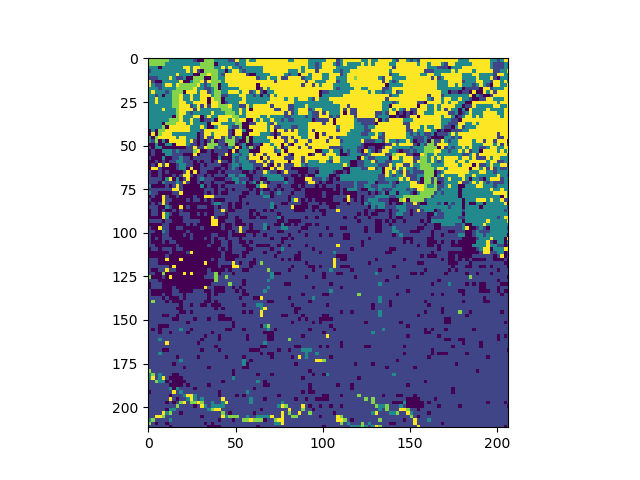

.. _Tutorial:

########
Tutorial
########

.. toctree::
   :maxdepth: 4

*******************************************************
Sources of documentation and help
*******************************************************

This documentation is written using the `sphinx <http://www.sphinx-doc.org>`_ tool.

====================
Online documentation
====================

The primary source of documentation is available online via this `website <https://jeodpp.jrc.ec.europa.eu/services/processing/pyjeohelp>`_.
The documentation is divided in three main parts:

* :ref:`Introduction`: Introduction explaining the organization of the pyjeo package, its modules, design, installation and usage.

* :ref:`Tutorial`: A tutorial to guide you through the first steps of using pyjeo, introducing the main data structures :py:class:`Jim`, :py:class:`JimList`, and :py:class:`JimVect`.

* :ref:`Reference`: A manual describing all functions and methods available in pyjeo

====================
Inline documentation
====================

In addition to the online help pages, there is the inline documetation. 

To get help on a specific module, e.g., :py:mod:`geometry`::

  help(pj.geometry)

To get help on a class, e.g., :py:class:`Jim`::

  help(pj.Jim)

To get help on a function, e.g., :py:func:`geometry.warp`::

  help(pj.geometry.warp)

To get help on a class method, e.g., :py:meth:`~geometry._Geometry.warp`::

  jim = pj.Jim()
  help(jim.geometry.warp)

.. _Tutorial_classification:

==========================
Tutorial on classification
==========================

.. _random_forest_classifier:

---------------------------------
Random Forest ensemble classifier
---------------------------------

Import relevant modules::

  from sklearn.ensemble import RandomForestClassifier
  from sklearn.model_selection import train_test_split
  from sklearn.metrics import confusion_matrix
  from sklearn.metrics import accuracy_score

We will use a vector file that contains reference data (in a numerical field 'label')

.. image:: figures/labels.png
   :width: 100 %

Load the vector file in a JimVect object::

  reference = pj.JimVect('training.sqlite')

Create a 3D Jim object that loads the raster data containing all features (read bands as planes)::

  jim = pj.Jim('/path/to/raster.tif', band2plane=True)

Extract features from the Jim object::

  featurevect = jim.geometry.extract(reference, rule=['allpoints'],
                                     output='/vsimem/features.sqlite',
                                     oformat='SQLite',
                                     co=['OVERWRITE=YES'],
                                     classes=[1, 2, 3, 4],
                                     copy='label',
                                     fid='fid')

Use the Numpy representation of the vector feature data to create arrays for the features (x) and label data (y)::

  x = featurevect.np()[:, 1:]
  y = featurevect.np()[:, 0:1]

Split the data in a training and test set::

  x_train, x_test, y_train, y_test = train_test_split(x, y,
                                                      test_size=0.33,
                                                      random_state=42)

Create a Random Forest classifier from sklearn and fit the model using the training data ::

  rfModel = RandomForestClassifier(n_estimators=100,
                                   max_depth=9,
                                   min_samples_leaf=5,
                                   min_samples_split=3,
                                   criterion='gini')
  rfModel.fit(x_train, y_train.ravel())

Use the unseen test set to perform an accuracy assessment::

  y_predict = rfModel.predict(x_test)
  print(confusion_matrix(y_test, y_predict))
  print('accuracy score: {}'.format(accuracy_score(y_test, y_predict)))

  [[29  8  2  6  0]
  [ 2 14  2  5  2]
  [ 0  2 13  3  9]
  [ 6  2  1 24  0]
  [ 0  0 15  0 20]]

  accuracy score: 0.606060606061

Classify the image using the Numpy representation of the Jim object::

  x = jim.np()
  x = x.reshape(jim.properties.nrOfPlane(), jim.properties.nrOfRow() * \
                jim.properties.nrOfCol()).T

  jim_class = pj.Jim(ncol=jim.properties.nrOfCol(),
                     nrow=jim.properties.nrOfRow(),
                     otype='Byte')
  jim_class.properties.copyGeoReference(jim)
  jim_class.np()[:] = rfModel.predict(x).astype(np.dtype(np.uint8)).\
      reshape(jim.properties.nrOfRow(), jim.properties.nrOfCol())

Show the classified map with matplotlib::

  import matplotlib.pyplot as plt

  fig = plt.figure()
  ax1 = fig.add_subplot(111)
  ax1.imshow(jim_class.np())
  plt.show()

.. image:: figures/rf_class.png
   :width: 100 %

.. _svm_classifier:

---------------------------------
Support Vector Machine classifier
---------------------------------

Import relevant modules::

  from sklearn.svm import SVC
  from sklearn import preprocessing
  from sklearn.model_selection import train_test_split
  from sklearn.metrics import confusion_matrix
  from sklearn.metrics import accuracy_score

Refer to random_forest_classifier_ to create a training and test data set

Create a support vector machine (SVM) classifier from sklearn and fit the model using the training data ::

  svmModel = SVC(gamma='auto')
  svmModel.fit(preprocessing.MinMaxScaler().fit_transform(x_train,
                                                          y_train.ravel())

Classify the image using the Numpy representation of the Jim object::

  x = jim.np()
  x = x.reshape(jim.properties.nrOfPlane(), jim.properties.nrOfRow() * \
                jim.properties.nrOfCol()).T

  jim_class = pj.Jim(ncol=jim.properties.nrOfCol(),
                     nrow=jim.properties.nrOfRow(), otype='Byte')
  jim_class.properties.copyGeoReference(jim)
  jim_class.np()[:] = svmModel.predict(preprocessing.MinMaxScaler().\
      fit_transform(x)).astype(np.dtype(np.uint8)).reshape(
          jim.properties.nrOfRow(), jim.properties.nrOfCol())

.. _Symbolic machine learning:

-------------------------
Symbolic machine learning
-------------------------
Symbolic machine learning (SML) is a classification method that is based on symbolic learning techniques. It is designed to work in complex and information-abundant environments, where relationships among different data layers are assessed in model-free and computationally-effective modalities (`reference <https://doi.org/10.3390/rs8050399>`_)

Import Numpy, Path and pyjeo::

  import numpy as np
  from pathlib import Path
  import pyjeo as pj

Locate the reference data (Corine Land Cover) and the input data::

  datadir = Path.home() / 'pyjeo/tests/data'
  clc = datadir / 'clc_32632.tif'
  testFile = datadir / 'modis_ndvi_2010.tif'

Create a subset from the Corine Land Cover classes::

  class_dict = {'urban': 2, 'agriculture': 12, 'forest': 25,
                'water': 41, 'rest': 50}
Create the reference dataset that contains only the target classes (2, 12, 25, 41, 50)::

  class_from = range(0, 50)
  class_to = [50] * 50
  for i in range(0, 50):
      if 1 <= i < 10:
          class_to[i] = class_dict['urban']
      elif 11 <= i < 22:
          class_to[i] = class_dict['agriculture']
      elif 23 <= i < 25:
          class_to[i] = class_dict['forest']
      elif 40 <= i < 45:
          class_to[i] = class_dict['water']
      else:
          class_to[i] = class_dict['rest']

Create coarse spatial resolution reference dataset::

  jim_ref = pj.Jim(clc, dx=1000, dy=1000)
  jim_ref.classify.reclass(classes=list(class_from), reclasses=class_to)

Open a spatial subset of the input image. Make sure the reference image entirely covers the input image::

  bbox = [4246000, 2547000, 4349500, 2441000]
  jim = pj.Jim(testFile, band2plane=True,
               ulx=bbox[0], uly=bbox[1], lrx=bbox[2], lry=bbox[3])

The reference image should be in the same projection as the input image::

  jim_ref.geometry.warp(jim.properties.getProjection())

Create a JimList from the reference (there can be multiple reference images)::

  reflist = pj.JimList([jim_ref])

Create the model by traning the SML::

  model = datadir / 'model_sml.dat'
  jim.classify.trainSML(reflist, output=model,
                        classes=sorted(class_dict.values()))

Classify the input image using the trained model::

  sml = pj.classify.sml(jim, model=model)

The result is a multi-band Jim object where the number of bands equals the number of classes and each band represents the probability for the respective class. To obtain a discrete classification result, based on the maximum probability, create a 3D multi-plane image from the multi-band image::

  sml.geometry.band2plane()

Use Numpy to select the maximum probability class. The output will refer to classes [0-4] (overwrite the first plane)::

  sml.np(0)[:] = np.argmax(sml.np(), axis=0)

Keep only the first plane::

  sml.geometry.cropPlane(0)

Value 0 is a valid class (do not consider 0 as nodata)::

  sml.properties.clearNoData()

Map the classes to the original class values::
  
  sml.classify.reclass(classes=[0, 1, 2, 3, 4],
                       reclasses=[2, 12, 25, 41, 50])

Plot the classification result::

  import matplotlib.pyplot as plt

  fig = plt.figure()
  ax1 = fig.add_subplot(111)
  ax1.imshow(sml.np())
  plt.show()
