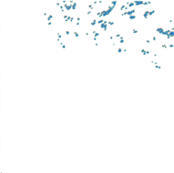
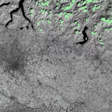

.. _Reference_manual:

################
Reference Manual
################

.. toctree::
   :maxdepth: 4

****************************************************
Data structures: rasters (Jim) and vectors (JimVect)
****************************************************

===
Jim
===

.. method:: Jim(filename=None, **kwargs)

  Creates a new Jim object, either :ref:`from file <create_Jim_from_file>`
  or :ref:`create new <create_Jim_new>`

:param filename: Path to a raster dataset or another Jim object
:param: see supported keys in table below
:return: a Jim object

.. _create_Jim_from_file:

Jim constructor: create Jim object from file
============================================

   Supported keys as arguments:

    ========== ===================================================
    band       Bands to open, index starts from 0
    ulx        Upper left x value bounding box
    uly        Upper left y value bounding box
    lrx        Lower right x value bounding box
    lry        Lower right y value bounding box
    dx         Resolution in x
    dy         Resolution in y
    resample   Resample algorithm used for reading pixel data
    extent     filename of a vector dataset from which to get boundary constraint
    nodata     Nodata value to put in image
    nogeo      Use image coordinates (index starts from 0,0 for upper left pixel)
    band2plane Read multi-band raster data as multi-plane Jim object
    noread     Set this flag to True to not read data when opening
    ========== ===================================================

   .. note::
        You can specify a different spatial reference system to define the
        region of interest to read set with keys ulx, uly, lrx, and lry with
        the extra key 't_srs'. Notice this will not re-project the resulting
        image. You can use the function :py:func:`geometry.warp` or the corresponding
        method on a Jim object :py:meth:`~geometry._Geometry.warp` in the :py:mod:`geometry` module.
   ..

   .. note::
      for resample values, please check `gdal site <https://gdal.org/doxygen/gdal_8h.html#a640ada511cbddeefac67c548e009d5ac>`_.

   .. note::
      To reduce the memory footprint, Jim objects support a tiling mechanism (see also the tutorial on :ref:`image_tiling`). The following extra keys can be used to read a single tile

   Specific keys for tiling:

    =========  ==============================================================================
    tileindex  Read only a portion (1 / tiletotal) of the image
    tiletotal  Amount of tiles in which the image must be divided (must be a squared integer)
    overlap    Overlap used for tiling (expressed in percentage), default is 0 (no overlap)
    align      Align the read portion of the file with the original pixel boundaries
    =========  ==============================================================================

   Example:

   Create Jim image object by opening an existing file (file content will
   automatically be read in memory)::

        ifn='T32TNR_20170805T102031_B08.jp2'
        jim = pj.Jim(ifn)
        # do stuff with jim ...

   Create Jim image object by opening an existing file for specific region of
   interest and spatial resolution using cubic convolution resampling::

        ifn = 'T32TNR_20170805T102031_B08.jp2'
        jim0 = pj.Jim(ifn, noread=True)
        ULX = jim0.properties.getUlx()
        ULY = jim0.properties.getUly()
        LRX = jim0.properties.getUlx() + 100 * jim0.properties.getDeltaX()
        LRY = jim0.properties.getUly() - 100 * jim0.properties.getDeltaY()
        jim = pj.Jim(ifn, ulx=ULX, uly=ULY, lrx=LRX, lry=LRY, dx=5, dy=5, resample='GRIORA_Cubic')
        # do stuff with jim ...

   Create Jim image object by opening an existing file, reading 10 columns and row, starting from the sixth (index=5) row and column::

        ifn = 'T32TNR_20170805T102031_B08.jp2'
        jim = pj.Jim(ifn, ulx=5, uly=5, lrx=14, lry=14, nogeo=True)
        # do stuff with jim ...

.. _create_Jim_new:

Jim constructor: create a new Jim image object by defining image attributes (not read from file)
================================================================================================

Supported keys as arguments:

===== =================
ncol  Number of columns
nrow  Number of rows
nband (default: 1) Number of bands
otype (default: Byte) Data type
a_srs Assign the spatial reference for the output file, e.g., psg:3035 to
      use European projection and force to European grid
===== =================

Supported keys used to initialize random pixel values in new Jim image
object:

======= ============================================
seed    (default: 0) seed value for random generator
mean    (default: 0) Mean value for random generator
stdev   (default: 0) Standard deviation for Gaussian random generator
uniform (default: 0) Start and end values for random value with uniform
        distribution
======= ============================================

Create a new georeferenced Jim image object by defining the projection epsg
code, bounding box, and pixel size::

        projection = 'epsg:32612'
        ULX = 600000.0
        ULY = 4000020.0
        LRX = 709800.0
        LRY = 3890220.0
        jim = pj.Jim(ulx=ULX, uly=ULY, lrx=LRX, lry=LRY, a_srs=projection, otype='GDT_UInt16', dx=100, dy=100)
        # do stuff with jim ...

Create a new georeferenced Jim image object for writing by defining
the projection epsg code, bounding box and number of rows and columns::

        projection = 'epsg:32612'
        ULX = 600000.0
        ULY = 4000020.0
        LRX = 709800.0
        LRY = 3890220.0
        jim = pj.Jim(ulx=ULX, uly=ULY, lrx=LRX, lry=LRY, a_srs=projection, otype='GDT_UInt16', ncol=1098, nrow=1098)
        # do stuff with jim ...

To initialize the pixel values to some value, either use the methode :py:meth:`Jim:setData`::

        jim.pixops.setData(100)

Alternatively, you can initialize the pixel values when creating the Jim object, selecting values for mean, stdev or uniform. For instance, create a new Jim object with data type float, 256 rows, 256 columns and set all values to 10::

        im = pj.Jim(otype='float32', ncol=256, nrow=256, mean=10)

Random values using a Gaussian distribution function can be generated by setting a value for stdev (e.g., 2)::

        im = pj.Jim(otype='float32', ncol=256, nrow=256, mean=10, stdev=2)

To generate random values with a uniform distribution with values between 100 and 200::

        im = pj.Jim(otype='float32', ncol=256, nrow=256, uniform=[100, 200])

.. _Jim_copy_constructor:

Copy constructor: create a new copy of a Jim raster data object
===============================================================

   Create a new Jim object from an existing Jim object, copying all data ::

        jim_copy = pj.Jim(jim)

   Create a new Jim object, using an existing Jim object as a template, without copying data.
   The new jim object will be initialized with all data set to 0::

        jim_copy = pj.Jim(jim, copy_data=False)

.. _Jim_numpy_constructor:

Create a new Jim raster data object from a Numpy array
========================================================

   Create a new Jim object by copying data from a Numpy array object (mynp)::

        jim = pj.np2jim(mynp)

   The Numpy array can be a 2D or 3D array::

        jim = pj.np2jim(mynp3d)
        jim.properties.nrOfPlane()
        12

   Notice that the newly created Jim object is not geo-referenced.
   We can add this information, e.g., by using a geo-reference object as a template::

        jim.properties.copyGeoReference(geojim)

.. _Jim_conversions:

Jim conversions
===============

Convert Jim object to numpy array
---------------------------------

.. method:: Jim.np(self, band: int = 0)

   Return a reference numpy array from Jim object.

   :param band: band index (starting from 0)
   :return: numpy array representation

Create a reference 2D numpy array from a single band GeoTIFF image (no memory copy)::

  jim = pj.Jim('/path/to/singleband.tif')
  jim.np()

Create a reference 2D numpy array from a selected band of multiband GeoTIFF image (no memory copy)::

  jim = pj.Jim('/path/to/multiband.tif')
  #select first band as numpy array
  jim.np(0)
  #select last band as numpy array
  jim.np(-1)

Create a reference 3D numpy array from a multiband GeoTIFF image (no memory copy)::

  jim = pj.Jim('/path/to/multiband.tif',band2plane=True)
  jim.np()

.. function:: jim2np(jim: Jim, band: int = 0)

   Return a new numpy array from Jim object.

   :param band: band index (starting from 0)
   :return: numpy array object

Create a new 3D numpy array from a multiband GeoTIFF image (with memory copy)::

  jim = pj.Jim('/path/to/multiband.tif',band2plane=True)
  array = pj.jim2np()

Convert Jim object to xarray
----------------------------

.. method:: Jim.xr(self)

   Return a reference xarray from Jim object.

   :return: xarray representation

Create an xarray from a Jim data cube using the Jim member function (without memory copy)::

  jim = pj.Jim('/path/to/multiband.tif',band2plane=True)
  jim.xr()

Multi-band 3D Jim objects can also be converted to xarray objects.

.. function:: jim2xr(jim: Jim)

   Return a new xarray object from Jim object.

   :return: xarray representation

Create a new xarray object from a Jim data cube using the pyjeo function (with memory copy)::

  pj.jim2xr(jim))

To write a Jim object to NetCDF file using xarray conversion, please refer to the :ref:`tutorial <tutorial_jim_write>`. 

.. _indexing:

Indexing: get and set Jim items
===============================

get Jim items
-------------

   .. method:: Jim[item]

      Get subset of the raster dataset. Item can be of type:

      :tuple: get all pixels defined by tuple (e.g., [0:10,0:10] for first 10 rows and columns in a single band image)

      :Jim: get all pixels where the specified raster dataset object is > 0

      :JimVect: get spatial subset of all pixels covered by the specified vector dataset object

      :returns: subset of the raster dataset

      Example:

      Get first 10 columns in first 10 rows::

        jim0[0:10, 0:10]

      The same result can be obtained when reading from file by constraining the bounding box in pixel (`nogeo=True`) coordinates::

        pj.Jim('/filepath.tif',ulx = 0, uly = 0, lrx = 9, lry = 9, nogeo = True)

      With this method, the memory footprint is smaller, because only the required bounding box is read into memory. This is shown with in the following snippet, using the memory_profiler::

        from memory_profiler import profile
        import pyjeo as pj

        fn = 'filepath.tif'

        @profile
        def f1():
            return pj.Jim(fn)[4:15,5:16]

        @profile
        def f2():
            return pj.Jim(fn, ulx = 4, uly = 5, lrx = 14, lry = 15, nogeo = True)

        assert f1() == f2()

      Result of the profiler::

        Line #    Mem usage    Increment  Occurences   Line Contents
        ============================================================
            6     87.8 MiB     87.8 MiB           1   @profile
            7                                         def f1():
            8     96.9 MiB      9.2 MiB           1       return pj.Jim(fn)[4:15,5:16]

        Filename: tests/b.py

        Line #    Mem usage    Increment  Occurences   Line Contents
        ============================================================
            10     96.9 MiB     96.9 MiB           1   @profile
            11                                         def f2():
            12     97.4 MiB      0.5 MiB           1       return pj.Jim(fn,ulx = 4, uly = 5, lrx = 14, lry = 15, nogeo = True)

      Get a binary mask of all values not within [0,250] (notice the parentheses to take care of the precedence of the operators!) ::

        jim0[(jim0 < 0) | (jim0 > 250)]

      Get a binary mask identifying  pixels where jim0<jim1::

        jim0[(jim0 < jim1)]

      Crop a raster dataset according to the extent of a vector dataset (crop_to_cutline), set all pixels not covered to 0 (or value defined as no data)::

        ifn = 'T32TNR_20170805T102031_B08.jp2'
        cfn = 'MSK_CLOUDS_B00.gml'
        jim = pj.Jim(ifn)
        v = pj.JimVect(cfn)
        jimcloud = jim[v]

   Result of a Jim get item, where only pixels within the cloud mask have been retained (values are represented by a single band pseudo-color)

Set Jim items
-------------

   .. method:: Jim[item]=

        Set items of the raster dataset. Item can be of type:

        :tuple: set all pixels defined by tuple (e.g., [0:10,0:10] for first 10 rows and columns in a single band image)
        :Jim: set all pixels where the specified raster dataset object is > 0
        :JimVect: set all pixels covered by the specified vector dataset object

        Modifies the instance on which the method was called.

        Example:

        Set first 10 columns in first 10 rows to 255::

          jim0[0:10,0:10] = 255

        Set all edge pixels to 0::

          jim[0, :] = 0
          jim[:, 0] = 0
          jim[-1, :] = 0
          jim[:, -1] = 0

        Mask all values not within [0, 250] and set to 255 (no data)::

          jim0[(jim0 < 0) | (jim0 > 250)] = 255

        Select the maximum of two Jim images::

          jim0[(jim0 < jim1)] = jim1

        Set a gml cloud mask to a Jim image (setting all cloudy pixels to 255)::

          ifn = 'T32TNR_20170805T102031_B08.jp2'
          cfn = 'MSK_CLOUDS_B00.gml'
          jim = pj.Jim(ifn)
          v = pj.JimVect(cfn)
          jim[v] = 255

   Result of a Jim set item: all pixels within the vector cloud mask have been set to a value 255 (represented in green)

=======
JimVect
=======

.. _JimVect_constructor:

Create a JimVect data object
=============================

To create a new JimVect vector data object, use the constructor :py:meth:`JimVect`. A JimVect object is typically created by opening an existing vector dataset from file or as the result from a function or method, e.g., the method :py:meth:`~geometry._Geometry.extract` in module :py:mod:`geometry` on a Jim object.

.. method:: JimVect(filename, **kwargs)

  Create a new JimVect object from file

:param filename:        Path to a vector dataset
:param ln:              Layer name to read (default is to read all layers)
:param attributeFilter: Set an attribute filter in restricted SQL WHERE format
:ulx:                   Upper left x value bounding box
:uly:                   Upper left y value bounding box
:lrx:                   Lower right x value bounding box
:lry:                   Lower right y value bounding box
:param noread:          Set this flag to True to not read data when opening
:return: a JimVect object

Example:

Open a vector and read all layers::

  v = pj.JimVect('/path/to/vector.sqlite')

Open a vector and read layer named lodi::

  v = pj.JimVect('/path/to/nuts.sqlite', ln='lodi')

Open a vector and read layer named lodi and save vector to new filename::

  v = pj.JimVect('/path/to/nuts.sqlite', ln='lodi')
  vnew = pj.JimVect(v, output='/path/to/newvect.sqlite')
  vnew.io.write()

Open a vector and use an attribute filter (the field intern_id must be between 10000 and 10500)::

  v = pj.JimVect('/path/to/vector.sqlite', attributeFilter='(intern_id > 10000) AND (intern_id < 10500)')

.. _JimVect_copy_constructor:

Copy constructor: create a new copy of a JimVect vector data object
===================================================================

   Create a new JimVect object from an existing JimVect object, copying all data ::

        v_copy = pj.JimVect(v, output = 'newcopy.sqlite')

Convert JimVect object to dictionary
====================================

.. method:: JimVect.dict(self, field: list = None, ln: int = 0)

   Return numpy array from JimVect object.

   :param field: list of fields to return
   :param ln: Layer to return
   :return: 2D numpy array representation of all fields of all features

Example::

  v = pj.Jim('/path/to/vector.sqlite')
  dictobject = v.dict()

Convert JimVect object to numpy array
=====================================

.. method:: JimVect.np(self, field: list = None, ln: int = 0)

   Return numpy array from JimVect object.

   :param field: list of fields to return
   :param ln: Layer to return
   :return: 2D numpy array representation of all fields of all features

Example::

  v = pj.JimVect('/path/to/features.sqlite')
  v.np()

Convert JimVect object to pandas object
=======================================

Example::

  import pandas as pd
  v = pj.Jim('/path/to/vector.sqlite')
  pob = pd.DataFrame(v.dict())

Convert JimVect object to geopandas object
==========================================

Example::

  import geopandas as gpd
  v = pj.JimVect('vector.shp)
  #convert to GeoJSON in memory
  vjson = pj.JimVect(v,output='/vsimem/pj.json', oformat = 'GeoJSON')
  vjson.io.close()
  #create geopandas dataframe from GeoJSON file in memory
  gdf = gpd.read_file('/vsimem/pj.json')

*********
Operators
*********

.. _comparison_operators:

====================
Comparison operators
====================

      Jim objects support comparison operations performed at pixel level. The result is a new binary Jim object (of type Byte) with value 1 if the comparison result is True and value 0 if the comparison result is False.

========   ============
Operator   Meaning
========   ============
``==``     Pixel wise check for equality
``!=``     Pixel wise check for inequality
``<``      Pixel wise check for less than
``>``      Pixel wise check for greater than
``<=``     Pixel wise check for less than or equal to
``>=``     Pixel wise check for greater than or equal to
========   ============

      Examples:

      Pixel wise check for equality. The result is a binary Jim object of type Byte: 1 if pixel values are equal and 0 if objects differ::

        result = jim1==jim2

      Set all pixel to 0 where Jim objects are equal::

        jim1[jim1==jim2] = 0

      Pixel wise check for inequality. The result is a binary Jim object of type Byte: 0 if pixel values are equal and 1 if objects differ::

        result = jim1!=jim2

      Set all pixel to 0 where Jim objects differ::

        jim1[jim1!=jim2] = 0

      Pixel wise check if an image is less than another::

        result = jim1<jim2

      Set all pixel values less than 0 to 0::

        jim0[jim0<0] = 0

      Pixel wise check if an image is less than or equal to another::

        result = jim1<=jim2

      Set all pixel values less than or equal to 0 to 0::

        jim0[jim0<=0] = 0

      Pixel wise check if an image is greater than another::

        result = jim1>jim2

      Set all pixel values greater than 0 to 0::

        jim0[jim0>0] = 0

      Pixel wise check if an image is greater than or equal to another::

        result = jim1>=jim2

      Set all pixel values greater than or equal to 0 to 0::

        jim0[jim0>=0] = 0

.. _boolean_operators:

=================
Boolean operators
=================

Jim objects support boolean operations performed at pixel level. Both input and result are assumed to be binary Jim objects of type Byte (0 is False, 1 is True).

========   ============
Operator   Meaning
========   ============
``|``      bitwise or
``^``      bitwise exclusive or
``&``      bitwise and
========   ============

      Examples:

      Calculate the bitwise or value of to Jim object::

        result = jim1 | jim2

      Get a binary mask of all values not within [0,250] (notice the parentheses to take care of the precedence of the operators!) ::

        result = jim0[(jim0 < 0) | (jim0 > 250)]

      Calculate the bitwise exclusive or (xor) value of to Jim object::

        result = jim1 ^ jim2

      Calculate the bitwise and value of to Jim object::

        result = jim1 & jim2

      Get a binary mask of all values within [100,200] (notice the parentheses to take care of the precedence of the operatands!) ::

        result = jim0[(jim0 >= 100) & (jim0 <= 200)]

.. _unary_operators:

==========================
Arithmetic unary operators
==========================

      Jim objects support unary arithmetic operations performed at pixel level.

========   ============
Operator   Meaning
========   ============
``abs``    absolute value
``-``      negation
========   ============

      Examples:

      Calculate the absolute value of Jim object::

        jimabs = abs(jim)

      Calculate the negation of a jim object. Notice that the output data type can be changed if the input was not signed. A warning message is given::

        jimneg = -jim

.. _binary_operators:

===========================
Arithmetic binary operators
===========================

      Jim objects support binary arithmetic operations performed at pixel level.

========   ============
Operator   Meaning
========   ============
``+``      addition
``+=``     addition and assignment
``-``      subtraction
``-=``     subtraction and assignment
``*``      multiplication
``*=``     multiplication and assignment
``/``      division
``/=``     division and assignment
``%``      modulo
``%=``     modulo and assignment
``<<``     bitwise left shift
``<<=``    bitwise left shift and assignment
``>>``     bitwise right shift
``>>=``    bitwise right shift and assignment
========   ============

      Examples:

      Add two Jim objects and return the result as a new Jim object::

        jim = jim1 + jim2

      Replace the content of jim1 with the sum of jim1 and jim2::

        jim1 += jim2

      Subtract two Jim objects and return the result as a new Jim object::

        jim = jim1 - jim2

      Replace the content of jim1 with the difference of jim1 and jim2::

        jim1 -= jim2

      Multiply two Jim objects and return the result as a new Jim object::

        jim = jim1 * jim2

      Replace the content of jim1 with the multiplication of jim1 and jim2::

        jim1 *= jim2

      Divide two Jim objects and return the result as a new Jim object::

        jim = jim1 / jim2

      Replace the content of jim1 with the division of jim1 and jim2::

        jim1 /= jim2

      Calculate the modulo of 2 (remainder after division of 2) and return the result as a new Jim object::

        jim = jim0 % 2

      Replace the content of jim1 with the modulo 2 (remainder after division of 2)::

        jim %= 2

      Multiply the pixel values by 2 and return as a new Jim object (by calculating the bitwise left shift)::

        jim2 = jim1 << 2

      Multiply the pixel values by 2 and replace the current Jim object (by calculating the bitwise left shift)::

        jim <<= 2

      Divide the pixel values by 2 and return as a new Jim object (by calculating the bitwise right shift)::

        jim2 = jim1 >> 2

      Divide the pixel values by 2 and replace the current Jim object (by calculating the bitwise right shift)::

        jim >>= 2

********************
Accessing properties
********************

.. automodule:: properties
   :members:

==============
Jim properties
==============

.. autoclass:: _Properties
   :members:

==================
JimVect properties
==================

.. autoclass:: _PropertiesVect
   :members:

==================
JimList properties
==================

.. autoclass:: _PropertiesList
   :members:

********************
Input/Output methods
********************

.. automodule:: pjio
   :members:

========================
Jim Input/Output methods
========================

.. autoclass:: _IO
   :members:

============================
JimVect Input/Output methods
============================

.. autoclass:: _IOVect
   :members:

============================
JimList Input/Output methods
============================

.. autoclass:: _IOList
   :members:

****************
Pixel operations
****************

=========================
Pixel operation functions
=========================

.. automodule:: pixops
   :members:
   :exclude-members: simpleArithOp, simpleBitwiseOp, simpleThreshold, setLevel

==============================
Pixel operation methods on Jim
==============================

.. autoclass:: _PixOps
   :members:
   :exclude-members: simpleArithOp, simpleBitwiseOp, simpleThreshold, setLevel

==================================
Pixel operation methods on JimList
==================================

.. autoclass:: _PixOpsList
   :members:

***********************
Neighborhood operations
***********************

.. _ndimage:

===========================================
Neighborhood operation from scipy (ndimage)
===========================================

The neighborhood operations from scipy ndimage can be applied to a :py:class:`Jim` object by using its numpy representation (:py:meth:`Jim.np`)

Perform a Gaussian filter on a single band Jim object using a standard deviation (sigma) of 2::

  from scipy import ndimage
  jim = pj.Jim('/path/to/image.tif')
  jim.np()[:] = ndimage.gaussian_filter(jim.np(), 2)

More examples are provided in the :ref:`Tutorial_filtering`.

=======================================
Native neighborhood operation functions
=======================================

.. automodule:: ngbops
   :members:

============================================
Native neighborhood operation methods on Jim
============================================

.. autoclass:: _NgbOps
   :members:

*******************
Geometry operations
*******************

============================
Geometry operation functions
============================

.. automodule:: geometry
   :members:
   :exclude-members: imageInsert, imageInsertCompose, imageFrameSet, imageFrameAdd, magnify

=================================
Geometry operation methods on Jim
=================================

.. autoclass:: _Geometry
   :members:
   :exclude-members: imageInsert, imageInsertCompose, imageFrameSet, imageFrameAdd, magnify

=====================================
Geometry operation methods on JimVect
=====================================

.. autoclass:: _GeometryVect
   :members:

******************************
Connected component operations
******************************

=======================================
Connected component operation functions
=======================================

.. automodule:: ccops
   :members:

============================================
Connected component operation methods on Jim
============================================

.. autoclass:: _CCOps
   :members:

**************
Classification
**************

=====================================
Classification from sklearn (ndimage)
=====================================

The classification operations from sklearn can be applied to a :py:class:`Jim` object by using its numpy representation (:py:meth:`Jim.np`)
For examples, please refer to the tutorial on :ref:`classification <Tutorial_classification>`

========================
Classification functions
========================

.. automodule:: classify
   :members:

=============================
Classification methods on Jim
=============================

.. autoclass:: _Classify
   :members:

*****************
Digital elevation
*****************

.. _dem_richdem:

========================================
Digital elevation functions from RichDEM
========================================

Digital elevation functions from third party packages that implement a data model that is compatible to Numpy arrays can easily be integrated with pyjeo. For instance, the High-Performance Terrain Analysis package `RichDem <https://richdem.readthedocs.io/en/latest/index.html>`_ has a data model similar to pyjeo, that can use Numpy arrays without a memory copy :cite:`RichDEM`. The geotransform and projection information must be copied from the Jim to the RichDEM object::

  dem_richdem.geotransform = jim.properties.getGeoTransform()
  dem_richdem.projection = jim.properties.getProjection()

For example, to calculate the slope in degrees, based on :cite:`horn1981hill` the functions from the `terrain attributes <https://richdem.readthedocs.io/en/latest/terrain_attributes.html>`_ can be used. A nice feature is that a no data value (-9999) can be discarded during the calculation. Here all values of the DEM smaller than or equal to 0 are discarded::

  import richdem as rd

  jim = pj.Jim('/path/to/dem.tif')
  jim.pixops.convert('GDT_Float32')
  jim[jim <= 0] = -9999
  dem_richdem  = rd.rdarray(jim.np(), no_data=-9999)
  dem_richdem.geotransform = jim.properties.getGeoTransform()
  dem_richdem.projection = jim.properties.getProjection()
  slope = rd.TerrainAttribute(dem_richdem, attrib='slope_degrees')
  jim.np()[:] = slope
  jim.properties.setNoDataVals(-9999)

=======================================
Native digital elevation methods on Jim
=======================================

.. automodule:: demops
   :members:

.. autoclass:: _DEMOps
   :members:

**************
Statistics
**************

========================
Statistical functions
========================

.. automodule:: stats
   :members:

=============================
Statistical methods on Jim
=============================

.. autoclass:: _Stats
   :members:

==============================
Statistical methods on JimList
==============================

.. autoclass:: _StatsList
   :members:
